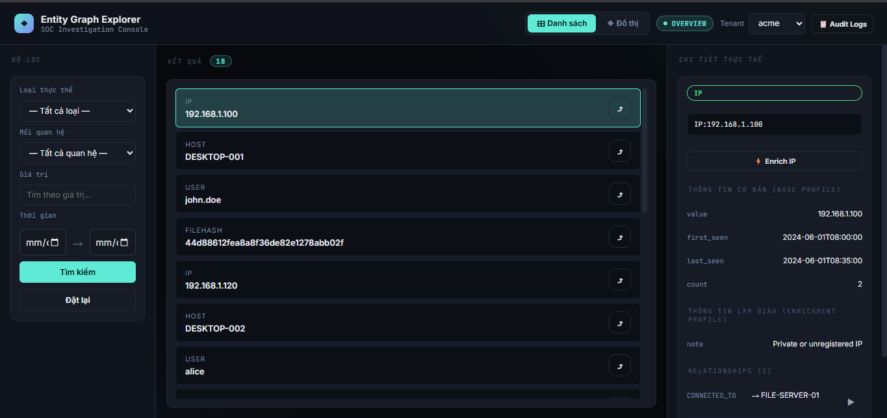
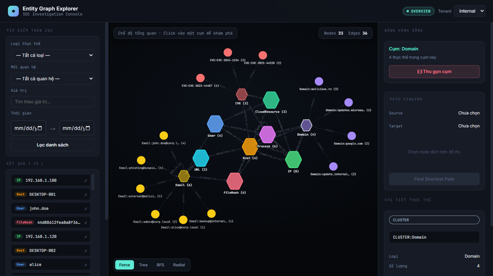
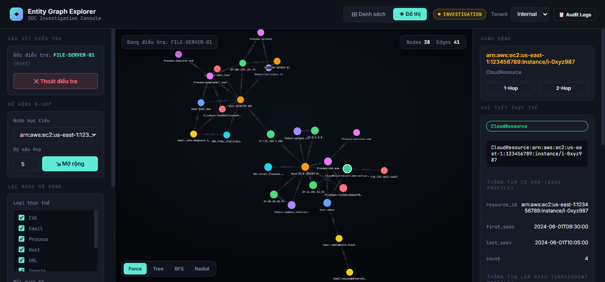
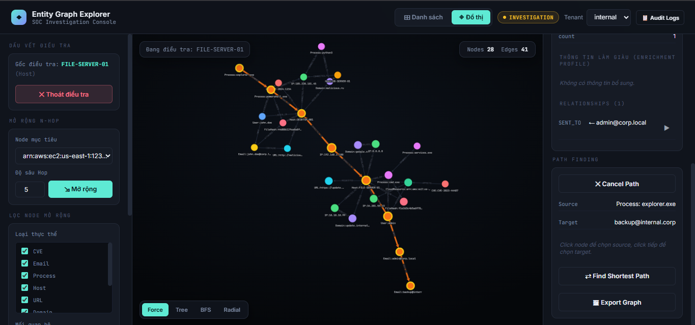
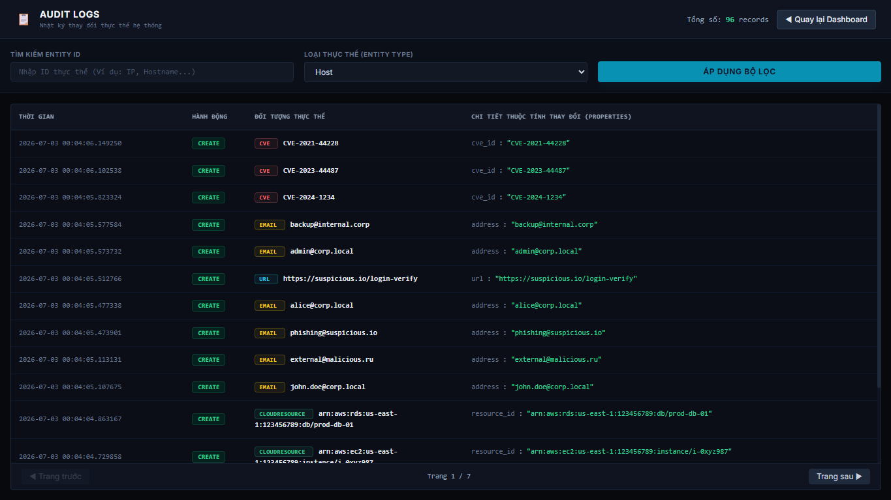

# Entity Management for SOC

A lightweight SOC investigation platform that extracts entities from security events, enriches threat intelligence data, and stores relationships inside Neo4j for graph-based investigation and visualization.

---

## Quick Start

### Prerequisites
- Docker & Docker Compose
- Python 3.12+ (for local development)
- Neo4j 5.18+

### Getting Started

```bash
git clone https://github.com/Nefen22/entity-management-for-soc
cd entity-management-for-soc
docker-compose up -d
```

| Service | URL |
| ------- | --- |
| API Docs (Swagger) | http://localhost:8000/docs |
| Frontend | http://localhost |
| Neo4j Browser | http://localhost:7474 |

### Quick Demo

```bash
# Ingest batch data
POST /api/tenants/{tenant}/graphs/ingest/batch

# Query entity graph (4-hop)
GET /api/tenants/{tenant}/graphs/entities/types/ip/values/8.8.8.8/graph/4
```

---

## Testing

The project includes comprehensive unit and integration tests with high code coverage.

### Running Tests

```bash
# Run all tests in Docker
docker-compose -f docker-compose.test.yml up --build --abort-on-container-exit

# Run specific test file
pytest backend/test/unit/test_auth.py -v
```

### Test Coverage

Current coverage: **89%** (58 tests passing)

Key modules with >95% coverage:
- `backend/auth/jwt.py` - 95%
- `backend/api/entities.py` - 100%
- `backend/database/` - 100%
- `backend/models/` - 100%
- `backend/parsers/edge_parser.py` - 100%

See [Testing Documentation](docs/TESTING.md) for detailed test information.

---

## Features

### Entity Extraction

Supported entities:

| Entity        | Example                                     |
| ------------- | ------------------------------------------- |
| User          | admin                                       |
| Host          | FILE-SERVER-01                              |
| IP            | 192.168.1.100                               |
| Domain        | malicious.ru                                |
| URL           | http://malicious.ru/payload.exe             |
| FileHash      | MD5 / SHA1 / SHA256                         |
| Process       | powershell.exe                              |
| Email         | admin@corp.local                            |
| CloudResource | EC2 instance, VM                            |
| CVE           | CVE-2024-1234                               |

---

### Flexible JSON Parser

The platform supports custom JSON-based event ingestion.

Supported sources:

* SIEM events
* EDR events
* Cloud audit logs
* Custom JSON formats

Parser logic is configurable and easy to extend.

---

### Entity Enrichment

#### IP Enrichment

* GeoIP lookup
* ASN information

#### File Hash Enrichment

* Mock VirusTotal dataset
* Malware detection information

Enrichment results are cached with TTL.

---

### Relationship Modeling

Core relationships:

* User → LOGGED_IN → Host
* Host → CONNECTED_TO → IP
* FileHash → EXECUTED_ON → Host

Additional relationships:

* Process → Host
* Email → User
* CVE → Host
* CloudResource → IP
* URL → Domain

Relationship metadata:

* first_seen
* last_seen
* count
* evidences

---

### Investigation Features

* Entity lookup
* Multi-hop investigation
* Cluster expansion / collapse
* Investigation mode
* Relationship filtering
* Entity type filtering
* Global search
* Shortest path finding between two entities
* Audit log viewer

---

### Graph Visualization

Powered by Cytoscape.js.

Supported layouts:

* Force-directed
* Breadth First Tree
* Dagre Tree
* Concentric

Features:

* Dynamic filtering
* Cluster expand/collapse
* Interactive investigation mode
* Entity detail panel
* Relationship metadata display
* Path finding visualization
* Audit log view
* Graph export (PNG)
* Multiple graph layouts

---

### Security & DevOps

* Docker Compose deployment
* GitHub Actions CI
* GitLab CI
* Trivy container vulnerability scanning
* Health checks for Neo4j
* Integration tests with Docker Compose

---

### Multi-Tenant Support

Each tenant is isolated using graph labels.

Example:

* acme
* google
* internal

API examples:

```
/api/tenants/logs
/api/tenants/{tenant}/entities
/api/tenants/{tenant}/graphs
/api/tenants/{tenant}/enrichments
```

---

### Performance

* Neo4j indexes
* Relationship aggregation
* Cached enrichment
* Optimized N-hop queries

---

## Tech Stack

| Layer     | Technology       |
| --------- | ---------------- |
| Backend   | FastAPI          |
| Database  | Neo4j            |
| Frontend  | HTML, JavaScript |
| Graph UI  | Cytoscape.js     |
| Container | Docker           |

---

## Implemented Features

* [x] Entity extraction (10 entity types)
* [x] Graph relationship modeling
* [x] Multi-hop investigation
* [x] GeoIP enrichment
* [x] Mock VirusTotal enrichment
* [x] Relationship metadata (first_seen, last_seen, count, evidences)
* [x] Graph visualization
* [x] Multiple layouts
* [x] Dynamic filtering
* [x] Multi-tenant support (label-based)
* [x] Neo4j indexing
* [x] REST API with Swagger docs
* [x] Docker Compose deployment
* [x] Investigation mode
* [x] Cluster expand/collapse
* [x] Shortest path finding
* [x] Audit log viewer
* [x] Graph export (PNG)
* [x] GitHub Actions CI
* [x] GitLab CI
* [x] Trivy vulnerability scanning

---

## Architecture

See [architecture.md](architecture.md)
---

## Documentation

- Requirements
- Architecture
- Roadmap

---

## Screenshots

### List & Detail Entities



### Graph Explorer



### Investigation Mode



### Path Finding



### Audit Logs



---

## Project Status

**MVP Complete** — backend, frontend, and core investigation features are implemented and running.

Remaining: test coverage, CI/CD, and optional advanced features listed in the roadmap above.