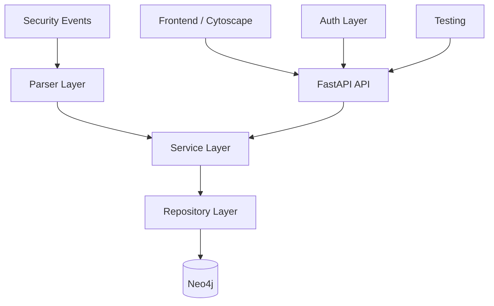

## Architecture Layers

### 1. API Layer (FastAPI)
- RESTful endpoints for entity management
- JWT authentication with test mode bypass
- Multi-tenant isolation
- Swagger/OpenAPI documentation
- Health checks and heartbeat endpoints

**Authentication:**
- JWT-based security
- HTTPBearer tokens
- Test mode support via `TESTING_IN_DOCKER` environment variable
- Automatic credential bypass for integration tests

### 2. Service Layer
- Business logic implementation
- Entity enrichment coordination
- Graph query orchestration
- Audit logging
- Transaction management

**Key Services:**
- `AuthService` - JWT token creation and validation
- `EntityService` - Entity CRUD and querying
- `GraphService` - N-hop traversal and path finding
- `EnrichmentService` - IP and hash enrichment

### 3. Parser Layer
- Multi-format log parsing (JSON, CSV, custom)
- Entity extraction from security events
- Relationship inference
- Evidence tracking

**Supported Formats:**
- SIEM alerts (JSON)
- EDR events (JSON)
- Cloud audit logs (JSON)
- Free-text alerts (LLM-based extraction)

### 4. Repository Layer
- Database abstraction for Neo4j
- Entity and relationship persistence
- Query optimization (indexes)
- Transaction handling

**Repositories:**
- `EntityRepository` - Node CRUD operations
- `GraphRepository` - Relationship queries
- `EnrichmentRepository` - Data enrichment storage
- `UserRepository` - User management

### 5. Authentication Layer
- JWT token generation and validation
- User credential verification
- Role-based access control
- Multi-tenant authorization

**Components:**
- `auth/jwt.py` - Token encoding/decoding
- `services/auth.py` - Authentication business logic
- `repositories/user.py` - User storage and lookup

### 6. Database Layer
- Neo4j graph database
- Relationship aggregation
- Index management
- Constraint enforcement

**Features:**
- APOC procedures for advanced queries
- Indexes on entity types and values
- Constraints for data integrity
- Transaction support

### 7. Testing Layer (New)
- 58 unit and integration tests
- 89% code coverage
- Docker-based test environment
- Isolated test database
- Mock external services

**Test Organization:**
- Unit tests for business logic
- Integration tests for API endpoints
- Test fixtures for data setup
- Mock services for external dependencies

---

## Data Model

### Entity Types

* **User** - System users
* **Host** - Computers/servers
* **IP** - IP addresses
* **Domain** - Domain names
* **FileHash** - File hashes (MD5/SHA1/SHA256)
* **URL** - Uniform Resource Locators / Web links
* **Process** - System processes and parent processes
* **CloudResource** - Cloud infrastructure components (AWS ARN, S3, Instances)
* **Email** - Electronic mail addresses (Senders and Recipients)
* **CVE** - Common Vulnerabilities and Exposures identifiers

### Entity Properties

* type - Entity classification
* value - Entity identifier
* metadata - Additional context
* first_seen - Initial observation timestamp
* last_seen - Most recent observation
* source - Origin of data

### Relationships

* **related_to** - Generic connection
* **accessed_by** - Access relationship
* **contains** - Containment relationship
* **executed_by** - Execution relationship
* **resolved_to** - DNS resolution
* **LOGGED_IN** - User authentication session on a host
* **CONNECTED_TO** - Network traffic establishment between hosts, IPs, domains, or processes
* **EXECUTED_ON** - File hash execution on a specific endpoint
* **RESOLVED** - DNS lookup initiated by a host or IP
* **RESOLVES_TO** - Domain mapping to a specific IP address
* **REQUESTED** - HTTP/HTTPS request sent to a URL by a host, IP, or process
* **RUNS_ON** - Process or cloud resource operating on a specific host
* **LOADED** - Process loading a library or file hash into memory
* **SPAWNED** - Parent process creating a child process
* **BELONGS_TO** - URL path associated with a specific domain
* **OWNS** - User account linked to an email address
* **HOSTED_BY** - Email service managed by a domain
* **SENT_TO** - Email transmission between communication endpoints
* **ACCESSED** - User interacting with a cloud resource
* **ASSIGNED_TO** - Cloud resource bound to an IP address
* **AFFECTS** - Security vulnerability impacting a host, process, or cloud resource

### Relationship Metadata
- count - Frequency of relationship
- first_seen - Initial observation
- last_seen - Most recent observation
- evidences - Supporting data points

---

## Deployment Architecture

### Docker Compose Setup
```yaml
services:
  api:
    - FastAPI application
    - Port: 8000
    - Environment: Production/Test
  neo4j:
    - Graph database
    - Port: 7687 (bolt)
    - Volume: Data persistence
  nginx:
    - Reverse proxy
    - Port: 80
    - Frontend serving
```

### Test Environment
```yaml
services:
  api-test:
    - FastAPI with test mode enabled
    - TESTING_IN_DOCKER=true
  neo4j-test:
    - Isolated test database
    - Clean state before each run
    - Test dataset pre-loaded
```

---

## Security Considerations

### Authentication
- JWT tokens with 15-minute expiration
- HTTPBearer token scheme
- Test mode requires explicit environment variable
- Prevents accidental production test authentication

### Authorization
- Multi-tenant isolation via graph labels
- Role-based access control (admin/user)
- Tenant-scoped API endpoints

### Data Protection
- Neo4j transaction logs
- Audit logging for all changes
- Encrypted connections (when configured)

---

## Performance Optimizations

### Database
- Indexes on entity type, value, and timestamp
- Relationship aggregation (count, first_seen, last_seen)
- Query result caching layer
- N-hop query optimization

### API
- Async/await for concurrent request handling
- Connection pooling for Neo4j
- Response compression
- HTTP caching headers

### Frontend
- Cytoscape.js graph rendering optimization
- Lazy loading of relationships
- Local caching of graph state
- Dynamic layout calculation

---

## Monitoring & Observability

### Logging
- Structured audit logs (JSON)
- API request/response logging
- Error and exception tracking
- Parser processing logs

### Metrics (Future)
- Request latency
- Database query performance
- Cache hit rates
- Error rates by endpoint

---

## Testing Strategy

### Unit Tests (44 tests)
- Service business logic
- Parser functionality
- Repository queries
- JWT token handling

### Integration Tests (12 tests)
- API endpoint validation
- End-to-end workflows
- Multi-tenant scenarios
- Database persistence

### Coverage Targets
- Critical path: 95%+ coverage
- Current overall: 89% coverage
- By module targets documented in [TESTING.md](TESTING.md)
