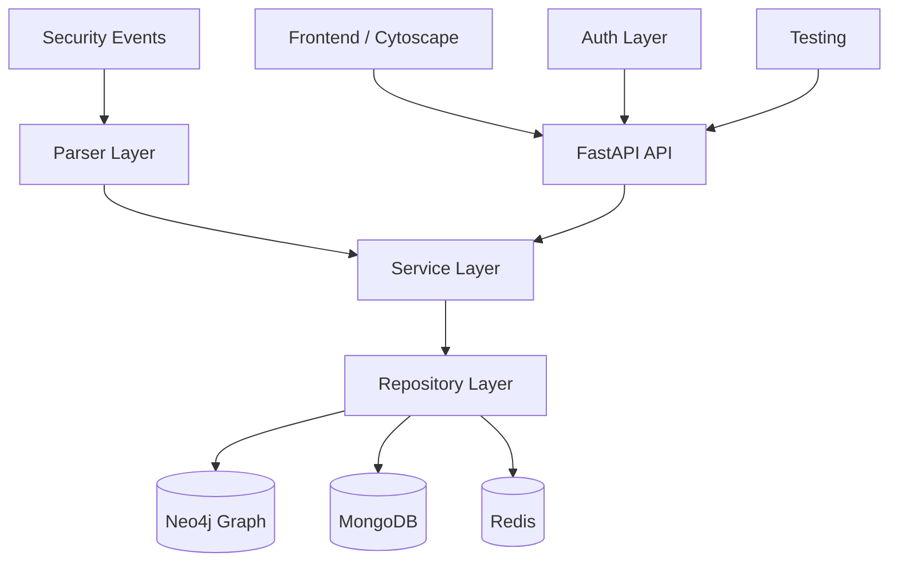

## Architecture Layers

### 1. API Layer (FastAPI)
- RESTful endpoints for entity management, graph traversal, enrichment, and audit log access
- JWT-based authentication with tenant-aware authorization
- Swagger/OpenAPI documentation and tenant-scoped routes

### 2. Service Layer
- Business logic for ingesting events, creating entities, building relationships, and enriching metadata
- Audit logging and evidence handling
- Tenant validation and permission checks

**Key services:**
- `services/auth.py` - login, JWT validation, and permission enforcement
- `services/entities.py` - entity creation and lookup
- `services/graph.py` - ingest, traversal, clustering, and path finding
- `services/enrichment.py` - automatic/manual enrichment orchestration
- `services/logs.py` - event and audit log retrieval

### 3. Parser Layer
- JSON, alert, and LLM-based parsing for security events
- Entity and relationship extraction with evidence tracking
- Event normalization so each event receives a timestamp and an event_id

### 4. Repository Layer
- Neo4j repositories for graph entities and relationships
- MongoDB repositories for users, roles, raw events, and audit logs
- Redis-backed enrichment cache for repeated lookups

### 5. Authentication and Authorization
- Users, roles, and permissions are stored in MongoDB collections
- Role-to-permission mappings are resolved at request time
- Tenant access is enforced per request and the API returns only authorized tenants

### 6. Data Stores
- Neo4j stores the graph of entities and relationships
- MongoDB stores raw events, audit logs, and authentication metadata
- Redis caches enrichment output to reduce repeated lookups

### 7. Testing Layer
- Pytest-based unit and integration tests
- Docker-based test environment that boots MongoDB, Neo4j, Redis, and the API service
- Test mode supports in-container auth bypass for CI-friendly integration tests

---

## Data Model

### Entity Types

- User
- Host
- IP
- Domain
- URL
- FileHash
- Process
- Email
- CloudResource
- CVE

### Relationship Metadata

- first_seen
- last_seen
- count
- evidences

### Storage Model

- Graph state lives in Neo4j
- Raw event payloads live in MongoDB as documents in the events collection
- Audit events live in MongoDB as documents in the audit_logs collection
- Evidence references an event_id so the original event can be retrieved on demand

---

## Deployment Architecture

### Docker Compose Setup

- `mongodb` provides the metadata and audit store
- `mongo-express` provides a browser-based admin UI
- `neo4j` provides the graph database
- `redis` caches enrichment responses
- `api` serves the FastAPI application
- `frontend` serves the static UI through Nginx

### Test Environment

- `mongodb-test` and `neo4j-test` run in isolation for pytest
- `api-test` uses `TESTING_IN_DOCKER=true` and seeds a test dataset before execution

---

## Security Considerations

- JWT tokens are issued for authenticated sessions
- Permissions are resolved from MongoDB-backed role definitions
- Tenant access is checked before tenant-scoped routes are executed
- External enrichment failures do not block ingestion or graph creation

---

## Operational Notes

- Enrichment uses cached responses when available
- Manual enrichment is available through the enrichment endpoint in addition to automatic ingestion-based enrichment
- Event IDs are generated with ULID when the source payload omits one

### Coverage Targets
- Critical path: 95%+ coverage
- Current overall: 89% coverage
- By module targets documented in [TESTING.md](TESTING.md)
