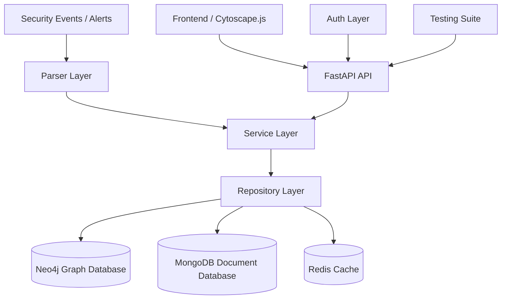

# System Architecture

The Entity Management for SOC platform consists of a backend REST API (FastAPI), graph database (Neo4j), document metadata storage (MongoDB), caching (Redis), and an interactive web interface (Cytoscape.js and Vanilla JS/HTML/CSS).

---

## Component Responsibilities

### 1. Frontend Client
- **Cytoscape.js Graph Visualization**: Renders node-relationship topologies representing security events.
- **Dynamic Controls**: Allows analysts to toggle time ranges, query hops, run shortest-path pathfinding, and trigger manual node enrichments.
- **Raw Event & Audit Log Views**: Displays original log JSON and paginated system audit entries directly inside the browser.
- **Nginx Proxy**: Routes web client requests and forwards `/api/` queries to the backend.

### 2. FastAPI API Layer
- **Router Configuration**:
  - `/api/auth`: Handles login and `/me` checks.
  - `/api/tenants`: Lists authorized tenants and aggregates sub-routes.
  - `/api/tenants/{tenant}/entities`: Lists, filters, and inspects nodes.
  - `/api/tenants/{tenant}/enrichments`: Triggers entity property updates.
  - `/api/tenants/{tenant}/graphs`: Controls ingestion (`/ingest`, `/ingest/batch`), cluster stats, paths, and n-hop queries.
  - `/api/tenants/{tenant}/logs`: Returns paginated audit logs and event lookups.
- **Tenant-Scoped Isolation**: Enforces tenant mapping checks dynamically via `validate_tenant` dependency.
- **Authentication**: Extracts JWT bearer credentials and resolves permissions through DB role checks.

### 3. Parser Layer
Converts raw log records into canonical entities and edges.
- **JsonParser (Config-Driven)**: Maps structured EDR, SIEM, CLOUD, or CANONICAL schemas directly based on event properties.
- **LLMParser (Gemini-2.5-flash)**: Uses regex preprocessing to substitute IPs, hashes, domains, and emails with indexing variables (`<ips_0>`, etc.). It calls the Gemini API to structure unstructured messages, and then restores variables to output canonical event formats.
- **AlertParser (Regex Fallback)**: Extracts IOCs from plain text using `iocextract` and pre-configured regular expressions, creating standard relationships between the found nodes.

### 4. Service Layer
Orchestrates business workflows and log generations.
- `services/auth.py`: Directs authentication, JWT token signing, and permission checks.
- `services/entities.py`: Controls entity creation, validation, and triggers audit log writes.
- `services/graph.py`: Executes data ingestion and manages multi-hop graph conversions.
- `services/enrichment.py`: Coordinates cache hits, fetches external APIs, and generates update audit trails.
- `services/logs.py`: Manages retrieval of events and audit logs from MongoDB repositories.

### 5. Repository Layer
Abstracts queries to databases.
- `repositories/graph.py` & `repositories/entities.py`: Execute Cypher queries using the async Neo4j driver.
- `repositories/mongo_repo.py`: Queries MongoDB collections (`users`, `roles`, `events`, `audit_logs`) via PyMongo.
- `repositories/enrichment.py`: Interacts with caching services and initiates API updates.

### 6. Caching Layer (Redis)
- Temporarily holds resolved external IP (GeoIP & AbuseIPDB) and FileHash (VirusTotal) payloads for 1 hour (`TTL = 3600s`).
- Bypasses duplicate external network API calls on repeat queries.

---

## Data Model & Relationships

### Entity Labels (Neo4j Labels)
Entities are stored with dual labels: `:{TenantDatabase}:{EntityType}` (e.g., `:Tenant_acme:IP`).

| Entity Type | Key Field | Example Property |
| --- | --- | --- |
| **`IP`** | `value` | `"104.21.43.11"` |
| **`User`** | `username` | `"administrator"` |
| **`Host`** | `hostname` | `"DESKTOP-HR01"` |
| **`Domain`** | `name` | `"filetransfer.io"` |
| **`FileHash`** | `hash_value` | `"e99a18c428cb38d5f260853678922e03"` |
| **`URL`** | `url` | `"https://filetransfer.io/download"` |
| **`Process`** | `process_name` | `"powershell.exe"` |
| **`Email`** | `address` | `"hr@acme.com"` |
| **`CloudResource`** | `resource_id` | `"arn:aws:s3:::confidential"` |
| **`CVE`** | `cve_id` | `"CVE-2024-3400"` |

### Relationship Metadata
All Neo4j relationships track history and validation references:
* `first_seen`: ISO timestamp of first occurrences.
* `last_seen`: ISO timestamp of latest updates.
* `count`: Aggregated count of events that contain this connection.
* `evidence`: ULID reference connecting to the MongoDB raw event table.

---

## Multi-Tenant Security & Isolation
- **Graph Separation**: Neo4j query statements format databases using tenant prefixes (e.g. `MATCH (n:Tenant_acme)`).
- **Authentication Scoping**: Users carry `tenants` permission lists in MongoDB. The token validation layer blocks requests aiming at unauthorized tenant parameters.
- **Audit Trails**: Every database modification records an audit entry tagged with the tenant identifier to ensure separate logging streams.
