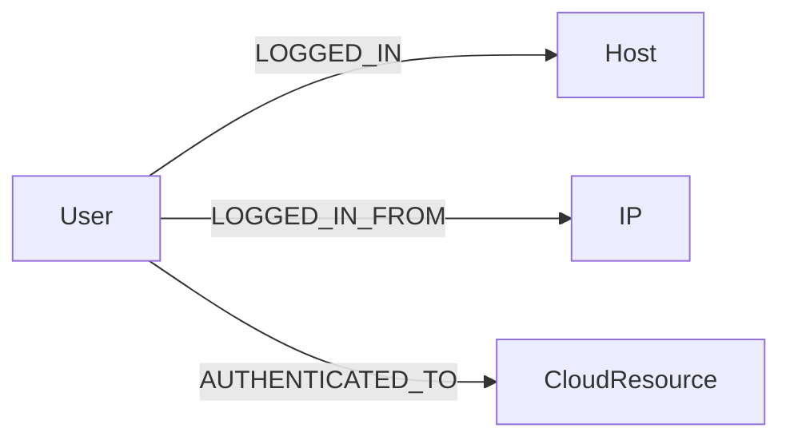
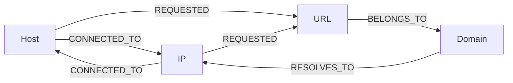
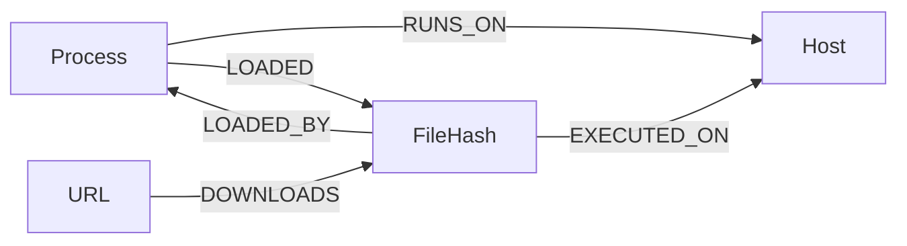
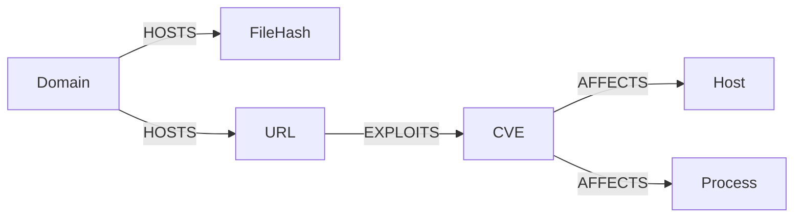

### 1. Authentication & Endpoint

```mermaid
graph LR
User -->|LOGGED_IN| Host
User -->|LOGGED_IN_FROM| IP
User -->|AUTHENTICATED_TO| CloudResource
```

---

### 2. Network

```mermaid
graph LR
Host -->|CONNECTED_TO| IP
IP -->|CONNECTED_TO| Host
Host -->|REQUESTED| URL
IP -->|REQUESTED| URL
URL -->|BELONGS_TO| Domain
Domain -->|RESOLVES_TO| IP
```

---

### 3. Malware

```mermaid
graph LR
Process -->|RUNS_ON| Host
Process -->|LOADED| FileHash
URL -->|DOWNLOADS| FileHash
FileHash -->|EXECUTED_ON| Host
FileHash -->|LOADED_BY| Process
```

---

### 4. Threat Intelligence

```mermaid
graph LR
CVE -->|AFFECTS| Host
CVE -->|AFFECTS| Process
Domain -->|HOSTS| FileHash
Domain -->|HOSTS| URL
URL -->|EXPLOITS| CVE
```
