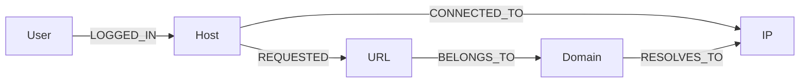
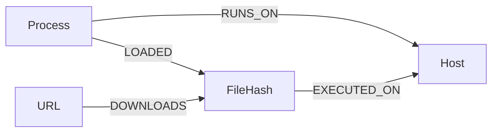
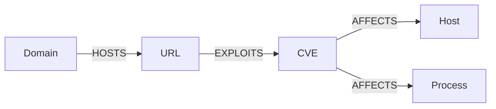

### 1. Core graph relationships

---

### 2. Execution and malware context

---

### 3. Threat intelligence context

---

### 4. Metadata stores

The implementation uses two metadata stores in addition to Neo4j:

- MongoDB `users` collection for authentication accounts
- MongoDB `roles` collection for role-to-permission mappings
- MongoDB `events` collection for raw event payloads
- MongoDB `audit_logs` collection for audit trail entries

Each audit log entry stores the tenant, timestamp, action, entity type, entity id, and change payload. Evidence references the original event via `event_id`, and the raw event is retrieved from MongoDB when needed.
